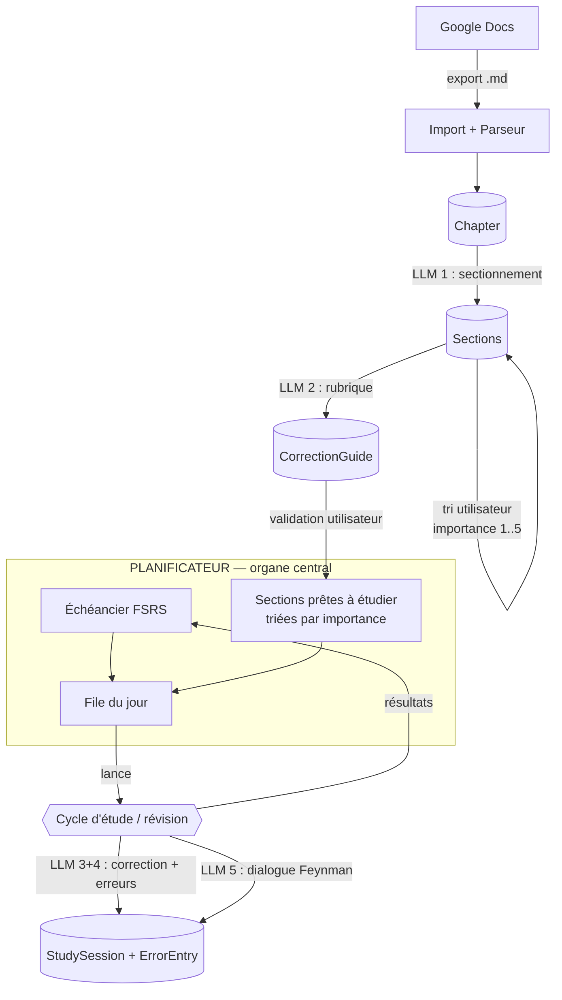

# ARCHITECTURE.md — Planificateur, machines à états & modèle de données

> **Statut** : v0.11
> **Rôle** : source de vérité structurelle. Toute proposition de modification du code (humaine ou IA) doit être vérifiée contre ce document. Si elle le contredit, soit elle est rejetée, soit ce document est révisé d'abord — jamais l'inverse.
> **Dépend de** : FORMAT.md v0.2 · TECH_MAPPING.md v0.2 (stack et délégations) · USER_FLOW.md v0.3 · FUNCTIONS.md v0.3 (services & invariants). **Complété par** : LLM_CONTRACTS.md.

---

## 1. Principes d'architecture

1. **Le planning est l'organe central.** Les timelines sont le nerf de la guerre : tout le système s'organise autour du Planificateur (§3). Les cycles d'étude et de révision sont des _processus subordonnés_, déclenchés depuis la file du jour. La page d'accueil de l'application EST le planning.
2. **Workflow déterministe, IA aux frontières.** Le Planificateur et les cycles sont des machines codées en dur. Les LLM interviennent à 5 points précis, avec entrées/sorties contractualisées (→ LLM_CONTRACTS.md et §9). Aucun LLM ne décide d'une transition d'état ni d'une échéance.
3. **L'utilisateur a toujours le dernier mot.** Chaque artefact IA (sectionnement, rubrique, correction) est une _proposition_ soumise à validation ou override.
4. **Ne jamais faire confiance à une sortie LLM sans validation Zod.** Tout appel passe par le module `llm/`, qui valide le schéma, retente sur échec, et journalise.
5. **Traçabilité versionnée.** Chaque session, rubrique et sectionnement enregistre la version du chapitre sur laquelle il repose (FORMAT.md §5).
6. **Mono-utilisateur d'abord.** Simplicité > généralité.

---

## 2. Vue d'ensemble du système



---

## 3. Le Planificateur (organe central)

Le Planificateur possède l'échéancier FSRS et compose chaque jour la **file du jour**, unique point d'entrée du travail :

```
file_du_jour =
    revisions_dues            # ReviewCard.due ≤ aujourd'hui
      triées par (retard DESC, importance DESC, proximité d'examen)
  + nouvelles_etudes          # sections en statut `prete`, jamais étudiées
      triées par (importance DESC, proximité d'examen, ordre curriculum)
      plafonnées à config.nouvelles_par_jour
  + re_file_intra_journee     # éléments regénérés le jour même :
      en queue                #   note `Again`, retry de blurting différé
```

Règles :

- **Les révisions passent toujours avant les nouvelles études** (la dette de révision est prioritaire — c'est le cœur de la répétition espacée).
- `config.nouvelles_par_jour` (défaut : 3) protège contre l'auto-surcharge ; modifiable.
- L'utilisateur peut réordonner sa file du jour (réordonnancement manuel roi : boutons shadcn v1, drag & drop HTML5 natif ensuite) et reporter un élément (journalisé, DeferralLog). Révision reportée ⇒ reste due, dette visible demain. **Nouvelle étude reportée ⇒ slot du jour perdu**, sans remplacement.
- **Re-file intra-journée** : une carte notée `Again` ou un blurting insuffisant à retenter revient en fin de file du jour même (section « à repasser aujourd'hui »). Un élément de re-file non traité expire en fin de journée : dette visible (révision) ou retour au vivier (étude).
- **Dates d'examen** : chaque matière peut porter une date d'examen ; elle départage les tris, s'affiche en compte à rebours (< 30 j) et se superpose à l'horizon. (Influence sur les intervalles FSRS : v2.)
- Le Planificateur affiche l'horizon : **charge de révision** des 7/30 prochains jours (étiquetée ainsi — le backlog d'études, sans dates, n'y figure pas), dette de retard, répartition par matière, échéances d'examens. C'est le tableau de bord d'accueil.
- Terminer un élément de la file (cycle d'étude réussi, ou révision notée) rend la main au Planificateur, qui propose l'élément suivant.

Le Planificateur ne contient **aucun appel LLM**. C'est du code pur, testé.

---

## 4. Machine A — Cycle de vie d'une Section

```
importee ──(LLM 1 : sectionnement)──▶ a_trier
a_trier ──(tri utilisateur : importance 1..5, renommage, fusion/scission)──▶
        ├── importance = 1 ─────────▶ exclue        [hors programme ; réversible]
        └── importance ≥ 2 ─────────▶ active
active ──(LLM 2, génération PARESSEUSE : à l'approche de la tête de file)──▶ rubrique_a_valider
rubrique_a_valider ──(utilisateur relit/édite/approuve — au plus tard en étape 0 du cycle d'étude)──▶ prete
prete ──(inscrite en "nouvelles études" du Planificateur)
prete ──(cycle d'étude complet réussi, machine B)──▶ validee
validee ──(ReviewCard créée, entrée à l'échéancier FSRS)──▶ en_revision
en_revision ──(révision en échec répété, machine C)──▶ prete   [retour en étude]

* ──(chapitre modifié, version++)──▶ invalidation ciblée (§7)
```

### Échelle d'importance (assignée au tri, modifiable à tout moment)

| Valeur | Sens               | Effet                                                             |
| ------ | ------------------ | ----------------------------------------------------------------- |
| **5**  | Très important     | tête de file des nouvelles études ; départage des révisions       |
| **4**  | Important          | idem, après les 5                                                 |
| **3**  | Standard           | ordre normal                                                      |
| **2**  | Secondaire         | étudié après tout le reste                                        |
| **1**  | **Hors programme** | statut `exclue` : ni rubrique, ni étude, ni révision. Réversible. |

- Changer l'importance d'une section déjà planifiée re-trie la file, ne détruit rien.
- Passer une section à 1 la retire du Planificateur ; repasser à ≥ 2 la réintègre (rubrique et historique conservés s'ils existent).

## 5. Machine B — Cycle d'étude d'une section `prete`

```
                    ┌──────────────────────────────────────┐
                    ▼                                      │
  debut ──▶ blurting_en_cours ──(soumission)──▶ correction_blurting
                                                     │ (LLM 3+4 : verdict proposé
                                                     │  + erreurs → carnet)
                    ┌────────── verdict:insuffisant ◀─┤
                    │  (retry, tentative n+1)          │ verdict:acquis
                    │                                  ▼
                    │                        feynman_en_cours (push-to-talk,
                    │                                  │       tours multiples, LLM 5)
                    │                                  │ (clôture par l'utilisateur)
                    │                                  ▼
                    └──────── verdict:insuffisant ◀─ bilan_feynman
                              (retour blurting OU            │ verdict:acquis
                               nouveau feynman, au            ▼
                               choix de l'utilisateur)   confirmation_utilisateur
                                                             │ (bouton "valider")
                                                             ▼
                                                section → validee → Planificateur
```

Règles de verdict et de cycle :

- **Le LLM propose, l'utilisateur dispose.** Verdict `acquis / insuffisant` calculé contre la rubrique (seuil : aucun point de contrôle _critique_ manquant). Override utilisateur possible dans les deux sens, journalisé (AuditService).
- **Divulgation contrôlée (côté serveur, P10)** : tant qu'un re-essai est attendu, la correction ne montre que les intitulés des points manquants/déformés, jamais les contenus attendus — qui ne transitent pas vers le client. Révéler est un choix explicite qui clôt la tentative.
- **Jamais de retry immédiat** : un blurting insuffisant repart par la re-file intra-journée, au plus tôt.
- Chaque tentative est une `StudySession` immuable.
- Le Feynman est une conversation multi-tours (audio transcrit tour par tour, transcript éditable avant envoi, audio détruit sitôt confirmé) close explicitement par l'utilisateur, suivie d'un bilan structuré unique **ancré sur la rubrique** (démontré avec explication / récité / non abordé).
- **Feynman requis pour l'importance ≥ 3 ; optionnel pour l'importance 2** (validation possible après blurting acquis).

## 6. Machine C — Révision (sous l'autorité du Planificateur)

- Une révision = un **blurting de rappel** (même interface, corrigé contre la même rubrique, LLM 3+4). Pas de Feynman en révision (v1).
- Après correction, l'utilisateur note : **Again / Hard / Good / Easy**. C'est cette auto-note — pas le verdict LLM — qui alimente FSRS ; le verdict sert d'aide à l'auto-évaluation.
- `Again` ⇒ re-file intra-journée (la carte revient en fin de file du jour même) ; **deux `Again` consécutifs** ⇒ la section retourne en `prete` (ré-étude complète via machine B, re-priorisée par le Planificateur).
- En révision, la divulgation de la correction est **complète d'emblée** (pas de retry à protéger).

---

## 7. Versionnage & invalidation en cascade

Sur sauvegarde du Markdown d'un chapitre (FORMAT.md §5) :

1. `hash(content)` identique ⇒ aucune action.
2. Sinon `version++`, puis **appariement** ancien plan / nouveau plan (titre + position) :
   - contenu source inchangé ⇒ section intacte (statut, rubrique, historique, ReviewCard conservés) ;
   - contenu modifié ⇒ rubrique → `obsolete` (à régénérer puis re-valider) ; statut conservé + badge « cours modifié » ; la section reste planifiée ;
   - section disparue ⇒ `archivee` (historique conservé, ReviewCard retirée de l'échéancier) ;
   - contenu nouveau ⇒ nouvelles sections en `a_trier`.
3. Les `StudySession` et `ErrorEntry` passées ne sont **jamais** modifiées : elles portent leur `chapter_version` d'origine.

---

## 8. Modèle de données

Notation : PostgreSQL, ORM Drizzle. Types indicatifs.

```
User          id, email, created_at

PlannerConfig user_id, nouvelles_par_jour INT DEFAULT 3,
              tts_active BOOLEAN DEFAULT true,   -- réglage P7 (Bloc 9.1)
              -- extensible : jours off, plafond de révisions/jour…

Subject       id, user_id, nom, semestre, ordre,
              date_examen DATE NULL,     -- pilote tris, compte à rebours, horizon
              statut ENUM(active, archivee),
              methodologie_titres TEXT NULL,  -- surcharge du document global
              archived_at TIMESTAMPTZ NULL    -- durée du gel (Bloc 9.1 fix, S6.unfreeze)

Chapter       id, subject_id, titre, markdown TEXT, version INT,
              content_hash, maj TIMESTAMPTZ,
              statut ENUM(actif, archive),
              archived_at TIMESTAMPTZ NULL    -- idem Subject.archived_at
              -- markdown = format de STOCKAGE ; l'édition se fait en WYSIWYG
              --   Tiptap limité aux 3 constructions, sérialisé vers cette colonne

Section       id, chapter_id, chapter_version INT,
              titre, ordre, niveau_source,
              contenu TEXT,             -- extrait du markdown, borné
              segments_gras JSONB,      -- positions des **…** (source rubrique)
              commentaires JSONB,       -- italiques extraits + ancrages
              importance SMALLINT CHECK (1..5),   -- 5 = très important, 1 = hors programme
              statut ENUM(importee, a_trier, active, exclue,
                          rubrique_a_valider, prete, validee,
                          en_revision, archivee),
              parent_ids UUID[]

CorrectionGuide  id, section_id, chapter_version INT,
                 contenu JSONB,         -- points de contrôle typés :
                                        --   {type: critique|important|secondaire,
                                        --    intitulé, attendu, piège_associé?}
                 statut ENUM(a_valider, valide, obsolete),
                 valide_le TIMESTAMPTZ

StudyCycle    id, user_id, section_id, type ENUM(etude, revision),
              etat ENUM(rubrique_a_valider, blurting, correction,
                        feynman, bilan, clos),        -- état persisté machine B/C
              bilan_feynman JSONB NULL,     -- bilan L5 (Bloc 7.2) : UN par cycle,
                                             --   pas une StudySession (pas de type "bilan")
              closed_at TIMESTAMPTZ NULL, created_at
              -- LE cycle en cours : porte l'invariant « une seule session
              --   ouverte par utilisateur » via INDEX UNIQUE PARTIEL :
              --   UNIQUE(user_id) WHERE closed_at IS NULL
              -- sert aussi la reprise (S4.resume lit le cycle ouvert + son état)
              -- et regroupe les tentatives d'un même cycle pour l'historique

StudySession  id, cycle_id → StudyCycle,             -- chaque tentative immuable
              section_id, guide_id, chapter_version INT,
              type ENUM(blurting, feynman, revision),
              tentative INT,
              input TEXT,               -- blurting OU transcript complet
              correction JSONB,
              verdict_llm ENUM(acquis, insuffisant),
              verdict_final ENUM(acquis, insuffisant),
              override BOOLEAN,
              note_fsrs ENUM(again, hard, good, easy) NULL,  -- si type=revision
              divulgation ENUM(controlee, complete),          -- traçabilité P10
              created_at

ErrorEntry    id, subject_id, section_id, session_id,
              type ENUM(omission, deformation, confusion, imprecision),
              description TEXT,         -- rédigée par LLM 4, éditable
              statut ENUM(active, resolue),
              occurrences INT DEFAULT 1, -- récidive (S7.commitCandidates) : incrémenté, jamais de doublon
              created_at

ReviewCard    id, section_id UNIQUE,
              due DATE, stability REAL, difficulty REAL,
              reps INT, lapses INT, last_review TIMESTAMPTZ,
              -- état FSRS standard (lib ts-fsrs)
              gelee BOOLEAN DEFAULT false
              -- seul champ que S6.freeze/unfreeze possède (FUNCTIONS §7)

DeferralLog   id, date, item_type, item_id, created_at,
              avance BOOLEAN DEFAULT false
              -- reports d'éléments de la file du jour (visibilité de la dette) ;
              --   avance=true : dette d'avance (S5.advanceFromBacklog, Bloc 9.2
              --   fix) plutôt qu'un report normal — slot perdu inconditionnellement,
              --   même une fois la section sortie du vivier

RefileItem    id, date, item_type ENUM(revision, etude), item_id, created_at
              -- re-file intra-journée ; expire en fin de journée
              --   (revision ⇒ dette visible, etude ⇒ retour au vivier)

QueueOrder    date PRIMARY KEY, order JSONB
              -- S5.reorder (FUNCTIONS §7 « purge de l'ordre manuel ») : la
              --   permutation manuelle du jour, tableau ordonné de {kind, id} ;
              --   mono-utilisateur comme DeferralLog/RefileItem ci-dessus

AuditEvent    id, type ENUM(override_verdict, revelation_correction, report,
                            acquittement_anomalie, validation_sur_insuffisant),
              entite_type, entite_id, created_at
              -- LA définition unique de « journalisé » (S8)

PromptConfig  user_id, methodologie_titres_globale TEXT NULL

PromptLog     id, appel ENUM(sectionnement, rubrique, correction_erreurs, feynman, transcription),
              prompt_version, model, input_tokens, output_tokens,
              duree_ms, statut ENUM(ok, retry, echec), created_at
```

Contraintes notables :

- `CorrectionGuide.statut = valide` **requis** pour qu'une section entre dans la file du jour.
- **Une seule session ouverte par utilisateur** : index unique partiel `StudyCycle(user_id) WHERE closed_at IS NULL` — l'invariant de S4 est tenu par la base, pas seulement par le service ; ouvrir un cycle = INSERT (échoue si un cycle ouvert existe), le clore = renseigner `closed_at`.
- Un seul `CorrectionGuide` non-obsolète par section.
- Le "carnet d'erreurs" est une vue filtrée d'`ErrorEntry` par matière, pas une table à part.

---

## 9. Les points d'appel LLM — contexte requis

Principe transversal : **jamais le cours entier dans les appels de correction** — la rubrique est la référence compacte ; le contexte de chaque appel est le minimum suffisant, énuméré ici. Schémas Zod exacts, budgets chiffrés, modèles choisis et comportements d'échec → LLM_CONTRACTS.md.

| #   | Appel                                                 | Déclencheur                                  | Contexte fourni (exhaustif)                                                                                                                                                                                                                                                                                                                              | Sortie (validée Zod)                                                                                                                                      |
| --- | ----------------------------------------------------- | -------------------------------------------- | -------------------------------------------------------------------------------------------------------------------------------------------------------------------------------------------------------------------------------------------------------------------------------------------------------------------------------------------------------- | --------------------------------------------------------------------------------------------------------------------------------------------------------- |
| 1   | **Sectionnement**                                     | import / re-version d'un chapitre            | • plan du chapitre (arbre des titres + niveaux)<br>• contenu intégral du chapitre (commentaires italiques retirés)<br>• méthodologie des titres juridiques (document utilisateur, statique)<br>• métadonnées : matière, chapitre                                                                                                                         | liste de sections proposées : {titre labelisé, bornes dans le source, justification courte}                                                               |
| 2   | **Rubrique**                                          | section passe `active`                       | • contenu de la section (source de vérité, italiques retirés)<br>• segments **gras** de la section (points de contrôle prioritaires)<br>• commentaires italiques de la section (contexte secondaire : difficultés personnelles)<br>• métadonnées : matière, chapitre, titre de section<br>• erreurs `actives` de la matière (résumés courts, plafonnées) | points de contrôle typés {critique/important/secondaire, intitulé, attendu, piège_associé?}                                                               |
| 3+4 | **Correction + extraction d'erreurs** (un seul appel) | soumission d'un blurting (étude ou révision) | • rubrique validée de la section<br>• texte du blurting soumis<br>• erreurs `actives` de la section (détection de récidive)<br>• n° de tentative<br>• **PAS le contenu du cours**                                                                                                                                                                        | • diff par point de contrôle {couvert/manquant/déformé + explication}<br>• verdict proposé<br>• 0..n ErrorEntry candidates {type, description, récidive?} |
| 5   | **Feynman** (par tour + bilan)                        | chaque tour de dialogue ; clôture            | • rubrique validée<br>• contenu de la section (nécessaire ici : le questionneur doit pouvoir vérifier les détails au-delà de la rubrique)<br>• historique des tours précédents de CETTE session<br>• erreurs `actives` de la section et de la matière (cibler les faiblesses connues)<br>• transcript du dernier tour                                    | tour : question/relance (texte libre)<br>bilan de clôture : structuré {points solides, lacunes, verdict proposé}                                          |
| 6   | **Transcription**                                     | chaque enregistrement push-to-talk           | • audio de l'enregistrement<br>• glossaire de la section (titres + segments gras) comme aide au vocabulaire juridique                                                                                                                                                                                                                                    | texte du transcript                                                                                                                                       |

---

## 10. Architecture applicative (Next.js)

```
app/                        # App Router
  (auth)/                   # Supabase Auth
  page.tsx                  # ACCUEIL = le Planificateur : file du jour,
                            #   horizon 7/30 j, dette, répartition par matière
  curriculum/               # arbre matières → chapitres → sections
  chapitre/[id]/editer      # éditeur markdown + rapport de validation
  chapitre/[id]/trier       # tri des sections (importance 1..5)
  section/[id]/rubrique     # relecture/édition/validation de rubrique
  etude/[sectionId]/        # cycle blurting → feynman (machine B)
  revision/[cardId]/        # blurting de rappel + auto-note (machine C)
  erreurs/                  # carnet d'erreurs par matière

src/
  core/                     # cœurs PURS (P1–P10, FUNCTIONS §1) : parser (règles
                            #   sur AST remark), planner, appariement, diff,
                            #   fsrs, divulgation — tests exhaustifs obligatoires
  services/                 # domaine (S1–S9, FUNCTIONS §3) : propriétaires des
                            #   invariants, frontières transactionnelles
  llm/                      # UNIQUE point d'accès à OpenRouter (L0)
    client.ts               # fetch + validation Zod + retry + PromptLog
    models.ts               # mapping appel → modèle (configurable)
    context/                # ContextBuilders purs par appel (contrat §9)
    schemas/                # schémas Zod des sorties
  db/                       # Drizzle : schéma + requêtes
  components/               # U1–U24 (FUNCTIONS §6) — shadcn, écrans = assemblages

prompts/                    # versionnés, hors code
  sectionnement.v1.md
  rubrique.v1.md
  correction_erreurs.v1.md
  feynman.v1.md
evals/                      # jeu d'or + canaris (à partir de la phase blurting)
```

Règles d'implémentation :

- `parser/`, `planner/`, `statemachine/`, `scheduler/` sont **purs** (aucune I/O) ⇒ testables sans mock. Ce sont les quatre modules avec exigence de tests unitaires systématiques.
- Server Actions pour toutes les mutations ; aucun appel LLM côté client (la clé OpenRouter ne quitte jamais le serveur).
- Audio Feynman v1 : MediaRecorder (navigateur) → upload → transcription serveur → tour de dialogue texte → TTS optionnel. Pas de temps réel.

### Stack retenue (consolidée depuis TECH_MAPPING v0.2 — doctrine : natif > shadcn/libs listées > maison)

| Couche                        | Choix                                                                                                                                                                                   |
| ----------------------------- | --------------------------------------------------------------------------------------------------------------------------------------------------------------------------------------- |
| Framework                     | Next.js App Router + TypeScript + Tailwind (imposé)                                                                                                                                     |
| Auth / BDD / ORM              | Supabase (Postgres) + Drizzle                                                                                                                                                           |
| Parsing Markdown              | **unified/remark** (AST mdast ; jamais MDX — TECH_MAPPING §0bis)                                                                                                                        |
| Éditeur de cours              | **Tiptap WYSIWYG façon Google Docs**, limité aux 3 constructions FORMAT ; Markdown = stockage/échange (tests de round-trip exigés)                                                      |
| UI                            | **shadcn/ui (Radix) exclusivement** ; réordonnancement de file : boutons shadcn v1 → drag & drop HTML5 natif ; horizon : barres Tailwind pures ; calendrier optionnel : shadcn Calendar |
| Diff                          | jsdiff + alignement par titres maison                                                                                                                                                   |
| LLM                           | **OpenRouter** via `fetch` natif, mapping appel → modèle configurable (`llm/models.ts`), validation Zod systématique                                                                    |
| Transcription / TTS / capture | modèle audio via OpenRouter (vigilance ADR 9, fallback Web Speech API) ; MediaRecorder et speechSynthesis natifs                                                                        |
| SRS                           | ts-fsrs                                                                                                                                                                                 |
| Hash                          | `crypto.subtle` natif                                                                                                                                                                   |
| Erreurs / chargement / focus  | mécanismes natifs App Router (`error.tsx`, `loading.tsx`, layouts, route groups — le mode focus est un layout de route)                                                                 |
| Tâches de fond                | Route Handlers + Vercel Cron (ou pg_cron) + `after()`                                                                                                                                   |

## 11. Décisions actées (ADR courts)

| #   | Décision                                                                                                         | Raison                                                                | Alternative rejetée                                                                                                                                                                                                                                                                                     |
| --- | ---------------------------------------------------------------------------------------------------------------- | --------------------------------------------------------------------- | ------------------------------------------------------------------------------------------------------------------------------------------------------------------------------------------------------------------------------------------------------------------------------------------------------- |
| 1   | Machines à états en dur, pas d'agent                                                                             | contrôle, coût, prévisibilité                                         | orchestration agentique                                                                                                                                                                                                                                                                                 |
| 2   | Verdict LLM = proposition, utilisateur = décideur                                                                | philosophie du projet                                                 | validation automatique                                                                                                                                                                                                                                                                                  |
| 3   | FSRS piloté par l'auto-note utilisateur                                                                          | input canonique de FSRS                                               | piloter par le verdict LLM                                                                                                                                                                                                                                                                              |
| 4   | Audio push-to-talk, pas de temps réel                                                                            | complexité disproportionnée                                           | WebRTC temps réel                                                                                                                                                                                                                                                                                       |
| 5   | Rubrique validée obligatoire avant planification                                                                 | neutralise le point de défaillance unique                             | rubrique implicite                                                                                                                                                                                                                                                                                      |
| 6   | Sessions immuables + version de chapitre partout                                                                 | historique interprétable                                              | mutation en place                                                                                                                                                                                                                                                                                       |
| 7   | Correction + extraction d'erreurs = un appel                                                                     | latence, coût, mêmes entrées                                          | deux appels                                                                                                                                                                                                                                                                                             |
| 8   | **Le Planificateur est l'organe central** ; étude et révision sont ses subordonnés ; l'accueil = la file du jour | les timelines sont le nerf de la guerre                               | SRS comme appendice du cycle d'étude                                                                                                                                                                                                                                                                    |
| 9   | Tout LLM et la transcription passent par OpenRouter                                                              | imposé ; fournisseur unique                                           | API Anthropic directe / Whisper OpenAI. **Point de vigilance** : OpenRouter n'expose pas d'endpoint de transcription dédié type Whisper ; la transcription se fait via un modèle acceptant l'audio en entrée (chat multimodal). À vérifier en début d'implémentation ; fallback prévu : Web Speech API. |
| 10  | Importance 1..5, 1 = hors programme (exclusion)                                                                  | échelle unique pour trier ET écarter                                  | statut `écartée` séparé                                                                                                                                                                                                                                                                                 |
| 11  | Divulgation contrôlée appliquée côté serveur + jamais de retry immédiat (re-file intra-journée)                  | anti-illusion de fluence ; les contenus masqués ne transitent pas     | masquage client ; retry immédiat                                                                                                                                                                                                                                                                        |
| 12  | Rubriques paresseuses (génération à l'approche de la tête de file)                                               | friction lissée, coût évité, validation attentive                     | génération en lot à l'import (option manuelle conservée)                                                                                                                                                                                                                                                |
| 13  | Édition WYSIWYG Tiptap limitée aux 3 constructions ; Markdown = stockage/échange                                 | la barre d'outils EST la convention ; invalidité d'emphase impossible | édition Markdown brute                                                                                                                                                                                                                                                                                  |
| 14  | UI 100 % shadcn ; zéro lib de charts/dnd/calendrier                                                              | doctrine natif > shadcn > maison ; dépendances minimales              | dnd-kit, Recharts, FullCalendar                                                                                                                                                                                                                                                                         |
| 15  | Parsing par remark, jamais MDX                                                                                   | données runtime, pas de JSX injectable, remark est la couche utile    | @next/mdx                                                                                                                                                                                                                                                                                               |

## 12. Hors périmètre v1

Multi-utilisateur collaboratif, génération de cas pratiques, audio temps réel, application mobile, statistiques avancées, import PDF. Toute apparition de ces sujets en session de vibecoding doit être refusée par défaut.

---

## 13. Journal des versions

| Version | Date       | Changement                                                                                                                                                                                                                                                                                                                                                                                                                                                                                   |
| ------- | ---------- | -------------------------------------------------------------------------------------------------------------------------------------------------------------------------------------------------------------------------------------------------------------------------------------------------------------------------------------------------------------------------------------------------------------------------------------------------------------------------------------------- |
| 0.11    | 2026-07-13 | Bloc 9.2 (préalable, audit états vides/erreur É2.0) : ajout de `DeferralLog.avance BOOLEAN DEFAULT false` (migration `0008_swift_stardust.sql`). Deux besoins distincts partageaient jusqu'ici le même `item_type="etude"` sans moyen de les distinguer : (a) un report normal d'une candidate encore dans le vivier (slot du jour perdu, corrigé dans le même bloc — `S5.todayQueue` remplaçait à tort la candidate reportée par la suivante du vivier, contraire à USER_FLOW É2.0 « aucune section ne la remplace ») et (b) une nouvelle mécanique `S5.advanceFromBacklog` (CTA « avancer une étude de demain », USER_FLOW É2.0) qui doit perdre un slot de DEMAIN inconditionnellement, y compris une fois la section étudiée et sortie du vivier — sans ce champ, réutiliser `DeferralLog` pour (b) aurait rouvert le bug de (a). Voir DECISIONS.md.                                                                                                     |
| 0.10    | 2026-07-13 | Bloc 9.1 fix (S1.archive/S9.archiveSubject) : ajout de `Chapter.archived_at`/`Subject.archived_at TIMESTAMPTZ NULL` — USER_FLOW É6.4 et FUNCTIONS §S6 exigent que `S6.unfreeze` « recalcule les échéances depuis les dates réelles » au désarchivage, ce que le modèle v0.9 (statut seul, sans horodatage) ne permettait pas de calculer. `S1.archive`/`S2.setImportance(1)`/la cascade restent les 3 appelants de `S6.freeze`/`unfreeze` (FUNCTIONS §S6) ; seuls `S1.archive` (via ce fix) et la cascade (déjà câblée Bloc 8.2) le font réellement, `S2.setImportance` reste non construit (DECISIONS.md Bloc 3.3). Supersède la doctrine « pur flip de statut, aucune cascade » du Bloc 9.1 initial. Voir DECISIONS.md. |
| 0.9     | 2026-07-09 | Bloc 9.1 (S9 réglages) : ajout de `PlannerConfig.tts_active BOOLEAN DEFAULT true` — USER_FLOW P7 exige un réglage de compte « TTS on/off », que `FeynmanChat` (Bloc 7.2) ne portait que comme un `useState` local jamais persisté. Réutilise `PlannerConfig` (une ligne par utilisateur) plutôt qu'une nouvelle table pour un seul booléen. Voir DECISIONS.md. |
| 0.8     | 2026-07-09 | Bloc 7.2 (L5.feynmanReport) : ajout de `StudyCycle.bilan_feynman JSONB` — le bilan de clôture Feynman est un artefact UNIQUE par cycle (pas une tentative : `study_session.type` n'a pas de valeur "bilan"), un seul propriétaire plutôt que de le loger dans le JSONB `correction` d'un tour. Tranché en récitation (lecture directe du modèle §8 existant : `study_cycle.etat` avait déjà `feynman`/`bilan` dans l'ENUM depuis v0.4, mais aucun champ pour porter le contenu du bilan lui-même). Voir DECISIONS.md.                                                                                                                        |
| 0.7     | 2026-07-09 | Bloc 6.3 (S5.reorder) : ajout de l'entité `QueueOrder(date PK, order JSONB)` — FUNCTIONS §3/§7 fait de S5 le seul propriétaire d'une « permutation datée, purgée à minuit », absente du modèle §8 v0.6. Une ligne par jour (tableau JSONB ordonné de clés `{kind,id}`) plutôt qu'une ligne par item positionné — la réconciliation avec la file fraîche du jour (P7) est un simple diff de tableau, et le réordonnancement v1 (boutons shadcn) envoie de toute façon l'ordre complet, pas un déplacement incrémental. Mono-utilisateur (pas de `user_id`), même doctrine que `DeferralLog`/`RefileItem`. Tranché avec l'humain (AskUserQuestion). Voir DECISIONS.md.                                                                                                                        |
| 0.6     | 2026-07-09 | Bloc 6.2 (S6.freeze/unfreeze) : ajout de `ReviewCard.gelee BOOLEAN DEFAULT false` — FUNCTIONS §7 fait de S6 « le seul propriétaire du gel », mais le modèle §8 v0.5 n'avait aucun champ pour le porter. Tranché avec l'humain (AskUserQuestion) plutôt qu'une dérivation implicite depuis `section.statut` (aurait recréé l'ambiguïté de propriétaire critiquée en FUNCTIONS §0). `due`/`stability`/`difficulty`/`reps`/`lapses`/`last_review` restent suffisants pour P9 (confirmé : `enable_short_term: false` élimine tout besoin de persister `state`/`learning_steps` ts-fsrs — une carte est toujours New (reps=0) ou Review (reps>0), jamais Learning/Relearning). Voir DECISIONS.md.                                                                                                                                        |
| 0.5     | 2026-07-09 | Bloc 5.3 (S7.commitCandidates) : ajout de `ErrorEntry.occurrences INT DEFAULT 1` — FUNCTIONS §3 S7 (« récidive incrémente le compteur ») et USER_FLOW É5.1 (« compteur de récidives ») exigeaient ce compteur, absent du modèle §8 v0.4. Tranché avec l'humain (AskUserQuestion) plutôt qu'un recalcul dynamique depuis les JSONB `StudySession.correction` (fragile, coûteux). Voir DECISIONS.md.                                                                                        |
| 0.1     | 2026-07-02 | Création                                                                                                                                                                                                                                                                                                                                                                                                                                                                                     |
| 0.4     | 2026-07-02 | Correction de modélisation (review) : ajout de l'entité **StudyCycle** (état persisté des machines B/C, `closed_at`) portant l'invariant « une seule session ouverte » via index unique partiel, la reprise de session et le regroupement des tentatives ; `StudySession.cycle_id`.                                                                                                                                                                                                          |
| 0.3     | 2026-07-02 | Consolidation : annexe A de USER_FLOW absorbée (date_examen, archivage matière/chapitre, RefileItem, divulgation tracée, AuditEvent, méthodologie globale+surcharge, rubriques paresseuses, Feynman optionnel importance 2) ; divulgation contrôlée et re-file inscrites aux machines B/C ; stack consolidée depuis TECH_MAPPING v0.2 (remark jamais MDX, Tiptap WYSIWYG, UI 100 % shadcn) ; arborescence alignée sur les 4 couches de FUNCTIONS (core/services/llm/components) ; ADR 11–15. |
| 0.2     | 2026-07-02 | Le Planificateur devient l'organe central (accueil = file du jour, étude/révision subordonnées). Importance 1..5 (1 = hors programme, remplace `écartée`). OpenRouter pour tous les appels LLM et la transcription (ADR 9 + vigilance). §9 : contexte requis énuméré pour chaque appel. Ajout PlannerConfig et DeferralLog.                                                                                                                                                                  |
