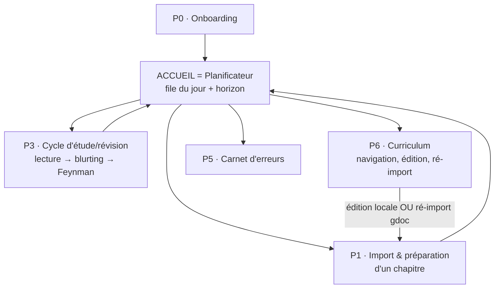

# USER_FLOW.md — Parcours utilisateur complet

> **Statut** : v0.7
> **Rôle** : décrit tous les parcours de la webapp, écran par écran, avec états, actions et transitions. Sert de référence pour l'UI et de checklist d'implémentation.
> **Dépend de** : ARCHITECTURE.md v0.2 (machines A/B/C, Planificateur), FORMAT.md v0.2. Les impacts de cette v0.2 sur le modèle de données sont listés en annexe A et devront être répercutés dans ARCHITECTURE.md.
> **Convention** : `[Action]` = bouton/interaction. `→` = navigation. Chaque écran liste son état vide et ses états d'erreur : un écran sans état vide spécifié est un bug de conception.

---

## 0. Carte des parcours

**Navigation globale (permanente)** : barre latérale — Aujourd'hui (accueil) · Curriculum · Erreurs · Réglages. Le logo ramène toujours à Aujourd'hui. Un cycle d'étude ou de révision en cours affiche un indicateur "session en cours — reprendre" dans la barre, sur toutes les pages.

**Source de vérité du cours** : le Google Doc reste ton document de travail (enrichi après TD, cours magistral…). L'app en détient une copie versionnée. Deux canaux de mise à jour : le **ré-import** (É6.3, canal principal) et l'**éditeur intégré** (É6.2, pour les retouches rapides). Attention : une retouche faite dans l'app et non reportée dans le Google Doc sera écrasée au prochain ré-import — l'écran de ré-import le rappelle et le diff la rend visible.

---

## P0 — Onboarding (première connexion)

### É0.1 Création de compte

Écran Supabase Auth (magic link). → É0.2.

### É0.2 Configuration initiale (4 étapes, skippables sauf la première)

1. **Matières** : création d'au moins une matière (nom, semestre, **date d'examen** — optionnelle mais fortement suggérée : « la date d'examen pilote les priorités »). `[Ajouter une matière]` répétable.
2. **Rythme** : `nouvelles_par_jour` (défaut 3, slider 1–10) avec une phrase d'explication du plafond.
3. **Méthodologie des titres** : zone de texte pour coller le document de méthodologie des titres juridiques (utilisé par le sectionnement, LLM 1). **Document global**, surchargeable matière par matière (depuis la fiche matière) si la méthodologie diffère, p. ex. entre histoire du droit et droit civil. Skippable — rappel affiché tant qu'absent.
4. Récapitulatif.

→ É1.0 avec un guide "importer votre premier chapitre".

### État vide global

Tant qu'aucun chapitre n'existe, l'accueil affiche un état vide didactique : les 3 étapes du pipeline (importer → trier → étudier) avec `[Importer un chapitre]` comme unique CTA.

---

## P1 — Import & préparation d'un chapitre

Transforme un Google Doc en sections triées. Quatre étapes (la génération de rubrique est **paresseuse**, cf. É1.5), avec reprise possible à tout moment (état persisté entre les étapes).

### É1.0 Choix de la destination

Depuis Curriculum ou l'accueil : `[Importer un chapitre]` → choix de la matière (ou création à la volée) + titre du chapitre. → É1.1.

### É1.1 Import du Markdown

- Instructions rappelées : _Google Docs → Fichier → Télécharger → Markdown_ (lien vers la page d'aide FORMAT).
- Zone : upload de fichier `.md` OU collage direct.
- `[Analyser]` → parseur (déterministe, instantané).

### É1.2 Rapport de validation (contrat FORMAT.md §6)

- Rendu du document avec la hiérarchie détectée, les **gras** et _commentaires_ surlignés de couleurs distinctes.
- Panneau d'anomalies : hiérarchie non descendante, gras+italique ambigus, Markdown mal formé — chaque anomalie cliquable (scroll vers l'occurrence).
- Actions : `[Corriger le texte]` (mini-éditeur inline) · `[Acquitter les anomalies]` · `[Valider l'import]` (bloqué tant que des anomalies non acquittées subsistent).
- → création du `Chapter` (version 1) → É1.3 lancée automatiquement.

**Erreur** : fichier illisible / vide → message + retour É1.1.

### É1.3 Sectionnement (LLM 1)

- Écran d'attente avec progression (streaming des sections au fil de l'eau si possible).
- Résultat : liste ordonnée des sections proposées — titre labelisé, aperçu des premières lignes.
- **Erreur LLM** (échec après retries) : message honnête + `[Relancer]` + secours `[Sectionner mécaniquement]` — cascade : par Titres 2 s'il y en a, sinon par Titres 1, sinon chapitre entier = une section. L'app n'est jamais bloquée par un appel LLM.
- `[Passer au tri]` → É1.4.

### É1.4 Phase de tri (machine A : `a_trier` → `active`/`exclue`)

Liste des sections avec, par ligne :

- titre **éditable inline** ;
- sélecteur d'importance **1..5** (5 = très important · 1 = hors programme, style segmenté, 3 présélectionné) ;
- `[Fusionner avec la précédente]` · `[Scinder]` (choix du point de coupe dans le texte) ;
- aperçu dépliable du contenu.

En-tête : compteur "X sections · Y exclues (importance 1)". `[Terminer le tri]` → sections `active` (ou `exclue`) → bandeau récapitulatif : « N sections actives — elles entreront dans votre file du jour ; chaque rubrique vous sera soumise juste avant la première étude » → `[Retour à Aujourd'hui]`.

### É1.5 Rubriques — génération PARESSEUSE (LLM 2 puis validation)

Il n'y a **pas** d'étape de rubriques en bloc à l'import. Règles :

- La rubrique d'une section est générée automatiquement en tâche de fond **quand la section approche de la tête de file** (entrée dans la file du jour de demain, ou à J-1), une par une.
- Elle t'est soumise pour validation **au moment pertinent** : badge « 1 rubrique à valider » sur l'accueil, et de toute façon en préambule de la première étude (impossible d'étudier une section sans rubrique `valide` — la validation devient l'étape 0 du cycle d'étude si elle n'a pas été faite avant).
- Écran de validation : points de contrôle groupés par type (**critique / important / secondaire**), chacun éditable (intitulé, attendu, piège associé), supprimable ; `[Ajouter un point]` ; le contenu de la section en vis-à-vis.
- `[Valider la rubrique]` → section `prete`. **Erreur LLM** : `[Relancer]` + rédaction manuelle possible.
- Option manuelle conservée : depuis le curriculum, `[Générer les rubriques de ce chapitre]` en lot, pour qui préfère tout préparer d'avance.

Bénéfices actés : friction lissée (une relecture à la fois, au moment où le contexte t'intéresse), pas de rubriques payées pour des sections d'importance 2 jamais atteintes, validation plus attentive.

---

## P2 — La journée type : accueil & file du jour

### É2.0 Accueil = Planificateur

Zones, de haut en bas :

1. **File du jour** : cartes ordonnées — révisions dues d'abord (badge retard si due < aujourd'hui), puis nouvelles études (plafonnées à `nouvelles_par_jour`). Chaque carte : matière (+ compte à rebours examen si < 30 j), titre de section, type, importance.
   - **Le réordonnancement manuel est roi** : l'ordre calculé est une suggestion, l'utilisateur a le dernier mot. Interaction : poignées/boutons de réordonnancement (shadcn) en v1, glisser-déposer HTML5 natif en amélioration progressive (TECH_MAPPING §4.2). Si une révision est déplacée sous des nouvelles études, un indicateur discret le signale (« 2 révisions repoussées ») — informatif, jamais bloquant.
   - `[Reporter]` par carte, journalisé (DeferralLog). **Révision reportée** : reste due, la dette s'affiche demain. **Nouvelle étude reportée : le slot du jour est perdu** — aucune section ne la remplace (sinon reporter ne coûte rien et le vivier défile sans travail).
2. **Re-file intra-journée** : les éléments regénérés en cours de journée — un cycle noté `Again` à la clôture du bilan (cf. É3.5 ; depuis la fusion Machine B/C, 2026-07-15, ceci s'applique aussi bien à une révision qu'à une première étude — les 2 passes de blurting elles-mêmes ne re-filent jamais, REVAMP v2) — s'ajoutent **en fin de file du jour même**, section visuellement distincte « à repasser aujourd'hui ». La file n'est donc pas figée le matin.
3. **Horizon** : graphe de **charge de révision** 7/30 jours (étiqueté ainsi — les nouvelles études sont un backlog sans dates et n'y figurent pas), dette de retard, répartition par matière, **échéances d'examens** marquées sur la timeline.
4. **Badges d'attention** : rubriques à valider, sections « cours modifié » (→ É6.2/É6.3), chapitres jamais triés.

Actions : `[Commencer]` sur une carte → **P3, dans tous les cas** (étude ou révision : même écran depuis la fusion Machine B/C, DECISIONS.md 2026-07-15 ; précédé de la validation de rubrique si elle est encore pendante, cf. É1.5).

**État vide** : « Rien à faire aujourd'hui » + prochaine échéance + CTA secondaires (importer, avancer une nouvelle étude de demain — ce qui consomme un slot de demain, pas d'aujourd'hui).

---

## P3 — Cycle d'étude et de révision (machine B, fusion Machine C)

> **v2 (REVAMP.md, 2026-07-15)** : rituel en 2 passes de blurting dans la même séance (grandes lignes → relecture ciblée → détail), verdict informatif (jamais bloquant), Feynman toujours atteint et obligatoire pour toute importance 2 à 5. La lecture du cours est désormais une étape de l'app (Machine B), pas une hypothèse sur ce qui a eu lieu ailleurs.
> **v3 (DECISIONS.md, 2026-07-15, post-hoc)** : ce parcours unique sert désormais AUSSI la révision (ex-P4/Machine C, fusionnée ici) — une section due en révision traverse exactement le même écran-par-écran qu'une première étude, Feynman compris. La différence entre « nouvelle étude » et « révision » redevient un simple badge/tri du Planificateur (§2), plus une distinction de parcours. L'auto-note FSRS (Again/Hard/Good/Easy), auparavant l'unique geste de la révision, se pose désormais à la clôture du bilan (É3.5) — condition nécessaire à la validation, quelle que soit la « Nᵉ fois ».

Plein écran, sans navigation latérale (mode focus). Barre de progression : (Rubrique) → Lecture → Blurting → Correction → (Lecture → Blurting → Correction) → Feynman → Bilan. Quitter en cours = session sauvegardée, reprise depuis l'accueil. Badge de contexte (« Étude » ou « Révision — Xᵉ rappel ») affiché sur l'écran de blurting — cosmétique uniquement, le parcours est identique dans les deux cas.

### É3.0 (conditionnel) Validation de rubrique

Si la rubrique est `a_valider` : écran É1.5 en préambule. Sinon, direct É3.1.

### É3.1 Lecture (nouveau — deux occurrences par cycle)

- **Lecture initiale** (avant blurting_1) : texte complet de la section (U3 `MarkdownViewer`), plein écran.
- **Relecture ciblée** (avant blurting_2, uniquement si une 2ᵉ passe a été choisie en É3.3) : même texte, seul (v0.8, DECISIONS.md 2026-07-15 — le diff en vis-à-vis retiré de l'écran, distinction avec la lecture initiale réduite au badge).
- Impossible de sauter l'étape : le bouton de blurting n'est atteignable que depuis cet écran.
- `[Je suis prêt, je blurte]` → compte à rebours de 30s (v0.7, retour sur « pas de minuteur ») avec `[Passer maintenant]` en échappatoire ; expiration ou clic → É3.2. `[Abandonner]` toujours disponible, y compris pendant le compte à rebours → retour accueil (cycle clos).

### É3.2 Blurting

- En-tête minimal : titre de la section, tentative n°X (1 ou 2). **Le contenu du cours n'est PAS accessible depuis cet écran** — pas d'onglet, pas de lien. C'est le principe du blurting.
- Instruction adaptée à la tentative : n°1 = « les grandes lignes, comme un plan » ; n°2 = « développe maintenant en détail ».
- Grande zone de texte (Markdown accepté), chrono discret (informatif, sans limite).
- `[Soumettre]` → sauvegarde immédiate → LLM 3+4 → É3.3. `[Abandonner]` → retour accueil (cycle clos).

### É3.3 Correction du blurting

- **Toujours affiché, intégralement** (divulgation toujours complète, dès la 1ʳᵉ correction — plus de masquage à protéger, le blurting est une étape d'un rituel piloté par l'étudiant, pas un test à protéger) : diff par point de contrôle — ✅ couverts (avec explication) · ❌ manquants (avec le contenu attendu) · ⚠️ déformés/imprécis (idem).
- **Verdict proposé**, affiché comme tel et purement informatif : « Verdict proposé : insuffisant — 2 points critiques manquants ». Il ne bloque plus rien, n'exige aucune confirmation ni override.
- Actions, selon la tentative :
  - **Tentative 1** : `[Relire, puis refaire un blurting]` → É3.1 (relecture ciblée) · `[Passer au Feynman]` (toujours disponible, quel que soit le verdict) · `[Abandonner]`.
  - **Tentative 2** : `[Passer au Feynman]` (seul choix menant plus loin) · `[Abandonner]`. Pas de 3ᵉ passe.
- **Erreurs candidates** (encadré) : les ErrorEntry proposées par LLM 4, statut explicite « proposées » — chacune éditable ou supprimable ; `[Tout accepter]`. **Règle de commit** : acceptées → enregistrées ; quitter l'écran sans statuer → auto-acceptées telles quelles (modifiables ensuite depuis le carnet). Badge « récidive » le cas échéant.
- **Erreur LLM** : le blurting est TOUJOURS sauvegardé d'abord ; `[Relancer la correction]` sans re-saisie.

### É3.4 Feynman (push-to-talk)

- **Obligatoire pour toute importance de 2 à 5** — une seule voie de validation, atteinte depuis É3.3 quel que soit le verdict (plus de `[Valider sans Feynman]`).
- Interface de conversation : bulles (toi / IA). Premier message IA : invitation à expliquer la section, orientée vers une erreur active connue le cas échéant. Les relances se construisent comme un développement progressif du dernier brouillon de blurting soumis, pas une exploration libre de la rubrique.
- **Bouton micro maintenu (ou verrouillable)** : enregistre → transcription (LLM 6) → ton tour s'affiche → **transcript éditable avant envoi** (corriger les erreurs de transcription, pas tes erreurs de fond) → `[Envoyer]` → réponse IA (LLM 5) + TTS optionnel (toggle).
- **L'audio est supprimé sitôt le transcript confirmé** — seul le texte persiste (coût, confidentialité).
- Alternative clavier toujours disponible.
- `[Clore et demander le bilan]` → LLM 5 (bilan) → É3.5.
- **Erreur transcription** : ré-écoute + `[Réessayer]` + bascule clavier.

### É3.5 Bilan Feynman & validation

- Bilan structuré **ancré sur la rubrique** : pour chaque point de contrôle — démontré à l'oral avec explication du pourquoi / seulement récité / non abordé — puis points solides, lacunes, verdict proposé, purement informatif (même doctrine qu'É3.3 : plus d'override sur CE point, plus de confirmation supplémentaire, plus de journalisation).
- **Auto-note FSRS, condition nécessaire à la clôture** (fusion Machine C, 2026-07-15) : « À quel point c'était difficile ? » `[Again] [Hard] [Good] [Easy]` — sous chaque bouton, la prochaine échéance prévisionnelle (« Good → revu dans ~12 j »). Impossible de valider la section sans choisir une note ; c'est cette auto-note — jamais le verdict LLM — qui pilote FSRS (ADR 3). S'applique à l'identique que ce soit la 1ʳᵉ validation de la section (la ReviewCard est créée puis notée dans la foulée) ou la Nᵉ (la carte existante est notée).
  - Si le bilan est **insuffisant**, une confirmation explicite reste requise avant de noter (comme aujourd'hui) — le choix de la note ne remplace pas cette confirmation.
- Autres actions :
  - `[Refaire un Feynman]` → É3.4 (nouvelle session) ;
  - `[Revenir au blurting]` → re-file intra-journée.
- **Cas `Again`** : en plus de la mise à jour FSRS, la section part en **re-file intra-journée** (réapparaît en fin de file du jour même) — assumé tel quel malgré le coût d'un cycle complet à rejouer (DECISIONS.md 2026-07-15). Le mécanisme v1 « 2ᵉ Again consécutif → retour en étude complète » disparaît : il n'existait que pour retomber sur une version allégée du cycle (Machine C), qui n'existe plus.

---

## P4 — ~~Révision (machine C)~~ (fusionnée dans P3, 2026-07-15)

> Machine C n'existe plus comme parcours séparé. Une section due en révision (`en_revision`) traverse désormais exactement le même écran-par-écran que P3 ci-dessus — lecture, blurting (≤2 passes), correction, Feynman, bilan avec auto-note FSRS obligatoire. Voir ARCHITECTURE.md §5/§6 et DECISIONS.md (2026-07-15, « Suppression de la dualité étude\|révision »).

---

## P5 — Carnet d'erreurs

### É5.1 Vue carnet

- Filtres : matière (onglets) · statut (actives/résolues) · type (omission, déformation, confusion, imprécision) · section.
- Liste : description, section d'origine (lien), date, compteur de récidives, badge type.
- Actions par erreur : `[Marquer résolue]` · `[Éditer]` · `[Supprimer]` (erreur créée à tort, confirmation) · `[Voir la session d'origine]` (lecture seule).
- **État vide** : « Aucune erreur active » (par matière).

---

## P6 — Curriculum : navigation, mise à jour, cycle de vie

### É6.0 Vue curriculum

Arbre matières → chapitres → sections : statut (pastille), importance, prochaine échéance si `en_revision`. Recherche plein texte. Fiche matière : date d'examen (éditable), surcharge de méthodologie des titres, `[Archiver la matière]` (cf. É6.4). Entrées : `[Importer un chapitre]` (→ P1), clic chapitre → É6.1.

### É6.1 Vue chapitre

Contenu rendu (gras/commentaires stylés), liste des sections avec statuts, historique des versions. Actions : `[Ré-importer depuis Google Docs]` (→ É6.3, canal principal de mise à jour) · `[Modifier dans l'app]` (→ É6.2, retouches rapides) · `[Re-trier les sections]` (→ É1.4) · `[Générer les rubriques en lot]` · `[Archiver le chapitre]` · `[Supprimer le chapitre]` (confirmation forte : nom à retaper ; l'archivage est proposé comme alternative).

### É6.2 Éditeur intégré (retouches rapides)

- Éditeur **WYSIWYG façon Google Docs (Tiptap)**, limité aux trois constructions de FORMAT.md (Titres 1–3, gras, italique — la barre d'outils EST la convention). Validation continue de la hiérarchie des titres (règles É1.2) ; le gras+italique est impossible à saisir. Sérialisation Markdown transparente pour le stockage (TECH_MAPPING §5).
- Bandeau permanent : « Pense à reporter cette modification dans ton Google Doc, sinon elle sera écrasée au prochain ré-import. »
- `[Sauvegarder]` : hash identique → toast « aucun changement » ; sinon **dialogue de conséquences AVANT commit** : « version N → N+1 · X sections intactes · Y rubriques invalidées · Z sections nouvelles à trier · W sections archivées » → `[Confirmer]` → cascade (ARCHITECTURE §7) → É6.1.

### É6.3 Ré-import depuis Google Docs (nouveau — canal principal)

1. Upload/collage du nouveau `.md` (mêmes règles qu'É1.1–É1.2, rapport de validation compris).
2. **Diff visuel** contre la version courante : ajouts / suppressions / modifications, côte à côte ou inline. Les passages modifiés dans l'app depuis le dernier import sont surlignés spécifiquement (« sera écrasé »).
3. Même dialogue de conséquences qu'É6.2 (sections intactes / rubriques invalidées / nouvelles à trier / archivées).
4. `[Confirmer le ré-import]` → version++ → cascade → les nouvelles sections partent en tri (É1.4), badges d'attention sur l'accueil.
5. `[Annuler]` sans effet à toute étape.

### É6.4 Archivage (matière ou chapitre) — fin de semestre

- Archiver **gèle** : les ReviewCards sortent de l'échéancier, les sections sortent de tous les viviers, plus aucune apparition dans la file du jour. **Tout l'historique est conservé** (sessions, erreurs, versions) et consultable en lecture seule.
- Réversible : `[Désarchiver]` réintègre les ReviewCards (FSRS recalcule les échéances depuis les dates réelles — de longs intervalles en découleront naturellement).
- Cas d'usage nominal : examen passé → archiver la matière. L'accueil suggère l'archivage quand la date d'examen d'une matière est dépassée depuis 7 jours.
- **Suppression** (matière/chapitre) : réservée aux erreurs de manipulation ; détruit l'historique ; confirmation forte ; l'archivage est toujours proposé d'abord.

---

## P7 — Réglages

Compte · rythme (`nouvelles_par_jour`) · méthodologie des titres (document global ; les surcharges se gèrent sur les fiches matières) · TTS on/off · export des données (JSON) · zone technique : modèle par appel LLM (lecture seule v1).

---

## Règles transversales

1. **Aucun appel LLM ne bloque définitivement un parcours** : chaque étape IA a `[Relancer]` + une voie de secours manuelle (sectionnement mécanique en cascade Titre 2 → Titre 1 → chapitre entier, rubrique manuelle, clavier au Feynman).
2. **Tout ce qui est saisi est sauvegardé avant tout appel LLM.**
3. **Les verdicts sont toujours « proposés »** ; tout override demande une confirmation légère et est journalisé.
4. **Divulgation toujours complète** en étude (dès la 1ʳᵉ correction, REVAMP v2 2026-07-15) comme en révision (jamais eu de retry à protéger) — plus aucun masquage nulle part dans le produit.
5. **2 passes de blurting max, la 2ᵉ immédiate dans la même séance (jamais de re-file pour ce motif)** — voir É3.1–É3.3, s'applique à toute répétition (étude ou révision, parcours unique depuis 2026-07-15). **`Again` à la clôture du bilan** (É3.5) : seul cas de re-file intra-journée.
6. **Mode focus** pour P3/P4 : pas de navigation, sortie = sauvegarde.
7. **Chaque écran a un état vide défini et un état d'erreur LLM.**
8. **Retour à l'accueil en fin d'élément** : le Planificateur rythme la session.
9. **Archiver plutôt que supprimer** : la suppression existe mais est enterrée derrière l'archivage.

---

## Annexe A — Impacts sur le modèle de données (à répercuter dans ARCHITECTURE.md)

| Objet          | Changement                                                                                                                                                            |
| -------------- | --------------------------------------------------------------------------------------------------------------------------------------------------------------------- |
| `Subject`      | + `date_examen DATE NULL` · + `statut ENUM(active, archivee)` · + `methodologie_titres TEXT NULL` (surcharge du document global)                                      |
| `User`/config  | + `methodologie_titres_globale TEXT NULL`                                                                                                                             |
| `Chapter`      | + `statut ENUM(actif, archive)`                                                                                                                                       |
| File du jour   | + notion de **re-file intra-journée** (éléments regénérés le jour même : Again, retry différé) — calculée, avec persistance légère (table `RefileItem` ou champ daté) |
| `StudySession` | + `divulgation ENUM(controlee, complete)` (traçabilité du mode de correction affiché)                                                                                 |
| Rubriques      | déclencheur de génération : approche de la tête de file (paresseux) et non plus le tri                                                                                |
| Machine B      | Feynman **obligatoire pour toute importance 2 à 5** (REVAMP v2, 2026-07-15) — plus de validation directe sur simple blurting                                          |
| Machine B/C    | **Fusionnées** (2026-07-15) : Machine C disparaît, toute révision traverse le cycle B complet. Auto-note FSRS déplacée à la clôture du bilan (É3.5), condition nécessaire à la validation |

---

## Journal des versions

| Version | Date       | Changement                                                                                                                                                                                                                                                                                                                                                                                                                                                                                                                                                                                                                                                                                                                                                                                                                                                          |
| ------- | ---------- | ------------------------------------------------------------------------------------------------------------------------------------------------------------------------------------------------------------------------------------------------------------------------------------------------------------------------------------------------------------------------------------------------------------------------------------------------------------------------------------------------------------------------------------------------------------------------------------------------------------------------------------------------------------------------------------------------------------------------------------------------------------------------------------------------------------------------------------------------------------------- |
| 0.8     | 2026-07-15 | Retour (avec l'humain) sur É3.1 : le diff de la correction précédente (`DiffList`) n'est plus affiché en vis-à-vis pendant la relecture ciblée — même texte seul dans les deux occurrences, la distinction redevient un simple badge. Voir FUNCTIONS.md v0.7, DECISIONS.md. |
| 0.7     | 2026-07-15 | Retour (post-hoc, avec l'humain) sur É3.1 : la transition lecture→blurting n'est plus « structurel, pas chronométré » — compte à rebours de 30s après `[Je suis prêt, je blurte]`, `[Passer maintenant]` en échappatoire. Voir ARCHITECTURE.md v0.14, DECISIONS.md. |
| 0.6     | 2026-07-15 | DECISIONS.md (« Suppression de la dualité étude\|révision », post-hoc REVAMP.md) : P4/Machine C supprimé comme parcours séparé, fusionné dans P3 — toute révision traverse désormais lecture→blurting→correction→Feynman→bilan comme une 1ʳᵉ étude. É3.5 gagne l'auto-note FSRS (Again/Hard/Good/Easy) comme condition nécessaire à la clôture. Carte des parcours, É2.0, règles transversales 2/5 et Annexe A mis à jour en conséquence. |
| 0.5     | 2026-07-15 | REVAMP.md v0.3 (tranché avec l'humain) : P3 réécrit — lecture devient un état/écran à part entière (É3.1, 2 occurrences par cycle), blurting/correction renumérotés É3.2/É3.3, plus de divulgation contrôlée ni de retry différé en étude (2 passes max, la 2ᵉ immédiate), Feynman (É3.4) toujours atteint et obligatoire pour toute importance 2 à 5 (bilan renuméroté É3.5), suppression de `[Valider sans Feynman]`/`[Retenter plus tard]`/`[Révéler les réponses]`, ajout d'`[Abandonner]` à l'écran de correction. Règles transversales 4/5 et Annexe A mises à jour en conséquence ; P4/Machine C intacte. |
| 0.4     | 2026-07-08 | É1.3 : retrait de « bornes visualisées sur une minicarte du document » — abandonné, pas reporté ailleurs (DECISIONS.md, bloc 3.3) ; la liste ordonnée + aperçu dépliable (U13) suffisent à juger le sectionnement.                                                                                                                                                                                                                                                                                                                                                                                                                                                                                                                                                                                                                                               |
| 0.1     | 2026-07-02 | Création                                                                                                                                                                                                                                                                                                                                                                                                                                                                                                                                                                                                                                                                                                                                                                                                                                                            |
| 0.3     | 2026-07-02 | Alignement TECH_MAPPING v0.2 : réordonnancement de la file par boutons shadcn (drag & drop HTML5 natif en amélioration progressive) ; É6.2 devient un WYSIWYG Tiptap limité aux trois constructions.                                                                                                                                                                                                                                                                                                                                                                                                                                                                                                                                                                                                                                                                |
| 0.2     | 2026-07-02 | Corrections issues de la revue critique : ré-import Google Docs avec diff (É6.3) + doctrine de source de vérité ; archivage matière/chapitre & suppression gardée (É6.4) ; dates d'examen en v1 (P0, fiches matières, horizon) ; drag & drop roi sur la file ; **divulgation contrôlée des corrections + interdiction du retry immédiat (re-file intra-journée)** ; Feynman optionnel pour importance 2 ; bilan Feynman ancré sur la rubrique ; règle de commit des erreurs candidates ; mécanique Again intra-journée ; report d'une nouvelle étude = slot perdu ; horizon étiqueté « charge de révision » ; audio supprimé après transcription ; fallback de sectionnement en cascade ; méthodologie des titres globale + surcharge par matière ; **rubriques paresseuses** (génération à l'approche de la tête de file, validation en étape 0 du cycle d'étude). |
